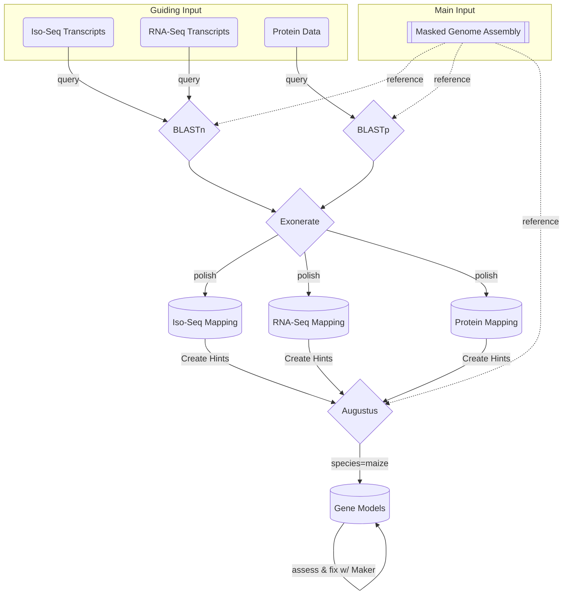
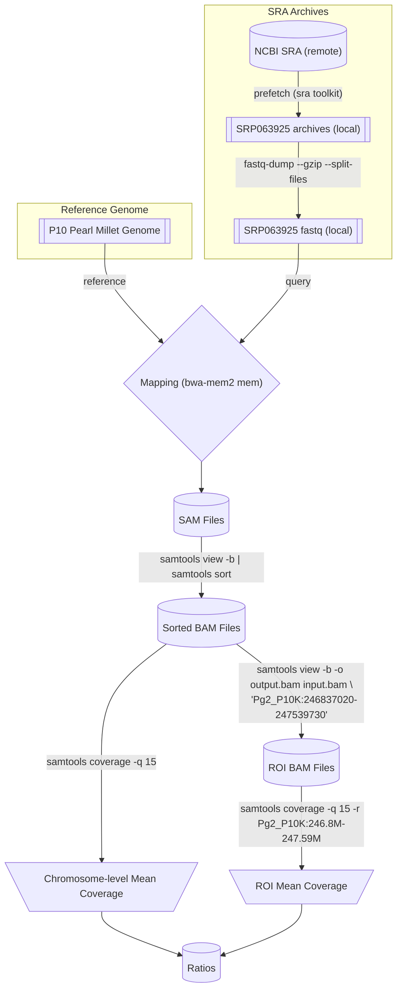

# The genome annotation of two pearl millet genomes :ear_of_rice:
### An annotation journey using the MAKER pipeline

<!-- TOC -->

## Summary
***
The following details the annotation pipeline I used to annotate two pearl millet genomes, codenamed internally as AWK and P10K. The main annotation pipeline I used is the MAKER pipeline <sup>[1](https://www.yandell-lab.org/software/maker-p.html)</sup>.

## I. Preparation of data for annotation
***
The following data are required for a decent gene annotation excercise:

- [x] A genome assembly
- [x] EST data: assembled RNASeq and/or ISOSEQ data from different plant tissues and under different conditions
- [x] Homology data: good quality proteomes of closely related species. One should also use the UniProt Swiss-Prot dataset <sup>[2](urlhttps://www.uniprot.org/uniprotkb?facets=reviewed%3Atrue&query=%2A)</sup>.

### 1. Genome assemblies
Done by Michael Abrouk. Briefly, HiFi data were assembled using hifiasm then OmniC data were used to scaffold and validate the higjhly contiguous hifiasm assembly.

### 2. EST evidence
#### 2.1. RNA-Seq data
1. This was done by Intikhab Alam. Briefly, rnaseq data were mapped on the respective genome using STAR taking into account that these rnaseq are unstranded.
>>>
`outSAMstrandField intronMotif`  This STAR option will guess strand info for spliced reads & inject this info in the sam/bam record which stringtie should/could pick up later. See this discussion thread https://github.com/alexdobin/STAR/issues/1208#issuecomment-827167185. (https://github.com/alexdobin/STAR/issues/1208#issuecomment-827167185)
>>>
2. Assembly of transcripts was done using StringTie then merged using StringTie merge mode.
#### 2.2. Iso-Seq data
```bash
# smrtlink_11.0.0.146107
### LIMA
lima --isoseq --peek-guess --num-threads 30 r64068_20220831_124330_2_B01.ccs.bam IsoSeq_Primers_12_Barcodes_v1.fasta fl.bam
### Remove poly(A) tails and concatemer
isoseq3 refine all.fofn IsoSeq_Primers_12_Barcodes_v1.fasta flnc.bam --require-polya --log-level DEBUG
### cluster
isoseq3 cluster flnc.bam clustered.bam --use-qvs --verbose
### collapse
pbmm2 align --num-threads 30 --preset ISOSEQ --sort clustered.hq.bam genome_assembly.fasta  mapped.s.bam
isoseq3 collapse mapped.s.bam awk.collapse.gff 
```

### 3. Homology evidence
#### 3.1 UniProt Swiss-Prot [Canonical and Isoforms]
```
downloaded on 2022.11.16
uniprot_sprot-2022.11.16.fasta:568363  # canonical
uniprot_sprot_varsplic-2022.11.16.fasta:40853  # isoforms
```
```bash
-rw-r--r-- 1 bougous cbrc-PrlMill_Babil  29M Oct 12 17:17 /ibex/scratch/projects/c2022/Analysis2022/sb/03.maker/00.protein/uniprot_sprot_varsplic-2022.11.16.fasta
-rw-r--r-- 1 bougous cbrc-PrlMill_Babil 270M Oct 12 17:17 /ibex/scratch/projects/c2022/Analysis2022/sb/03.maker/00.protein/uniprot_sprot-2022.11.16.fasta
```
#### 3.2. Pearl Millet [_Cenchrus americanus_]
Paper: https://www.nature.com/articles/nbt.3943

I could not download the protein annotation from http://gigadb.org/dataset/view/id/100192
so I downloaded the annotation from https://cegresources.icrisat.org/data_public/PearlMillet_Genome/v1.1/ (cited in the paper) labelled as v1.1
```
PM.genechr.trans.pep:35791
PM.genescf.pep:2788
```
```bash
-rw-r--r-- 1 bougous cbrc-PrlMill_Babil 1.1M May 30  2016 /ibex/scratch/projects/c2022/Analysis2022/sb/03.maker/00.protein/PM.genescf.pep
-rwxr-xr-x 1 bougous cbrc-PrlMill_Babil  15M May 30  2016 /ibex/scratch/projects/c2022/Analysis2022/sb/03.maker/00.protein/PM.genechr.trans.pep
```

#### 3.3. Green Millet [_Setaria viridis_]
Paper: https://www.nature.com/articles/s41587-020-0681-2

I cannot find the annotation described in the paper so I am using the one from NCBI annotation pipeline
https://www.ncbi.nlm.nih.gov/genome/annotation_euk/Setaria_viridis/100/

protein annotation downloaded from
https://ftp.ncbi.nlm.nih.gov/genomes/all/annotation_releases/4556/100/GCF_005286985.1_Setaria_viridis_v2.0/GCF_005286985.1_Setaria_viridis_v2.0_protein.faa.gz

```bash
-rw-r--r-- 1 bougous cbrc-PrlMill_Babil  21M May 25  2020 /ibex/scratch/projects/c2022/Analysis2022/sb/03.maker/00.protein/GCF_005286985.1_Setaria_viridis_v2.0_protein.faa
```

#### 3.4. Foxtail millet [_Setaria italica_]
https://ftp.ncbi.nlm.nih.gov/genomes/all/annotation_releases/4555/103/GCF_000263155.2_Setaria_italica_v2.0/GCF_000263155.2_Setaria_italica_v2.0_protein.faa.gz

```bash
-rw-r--r-- 1 bougous cbrc-PrlMill_Babil  19M Dec 11  2019 /ibex/scratch/projects/c2022/Analysis2022/sb/03.maker/00.protein/GCF_000263155.2_Setaria_italica_v2.0_protein.faa
```

#### 3.5. The elephant grass [_Cenchrus purpureus_]
Paper: https://doi.org/10.1111/1755-0998.13271

CANNOT DOWNLOAD THE ANNOTATION FROM CHINESE SERVER. I SENT AN EMAIL TO CORRESPONDING AUTHORS.
https://download.cncb.ac.cn/gwh/Plants/Cenchrus_purpureus_Elephant_grass_cv._Purple_GWHAORA00000000/GWHAORA00000000.Protein.faa.gz

#### 3.6. Sorghum [_Sorghum bicolor_]
https://ftp.ncbi.nlm.nih.gov/genomes/all/annotation_releases/4558/101/GCF_000003195.3_Sorghum_bicolor_NCBIv3/GCF_000003195.3_Sorghum_bicolor_NCBIv3_protein.faa.gz

```bash
-rw-r--r-- 1 bougous cbrc-PrlMill_Babil  21M Dec 11  2019 /ibex/scratch/projects/c2022/Analysis2022/sb/03.maker/00.protein/GCF_000003195.3_Sorghum_bicolor_NCBIv3_protein.faa
```

## II. MAKER pipeline
***

The **workflow** above gives an overall description of the MAKER2 modules that we used in this genome annotation effort. We ran the MAKER2 workflow in a HPC envrinment on KAUST Ibex compute cluster. We made full use of parallelisation through the MPICH integration. Below is an example submission job. This was not without difficulty as we had many failed jobs due various reasons including: out of memory errors (hence the SLURM mem specification below) and other random errors that seem to be related to the filesystem.

```bash
#!/bin/bash
#SBATCH -n 30
#SBATCH -N1
##SBATCH --mem-per-cpu=30G
#SBATCH --mem=0
#SBATCH -t 1-00:00:00

export PATH=/ibex/scratch/bougous/kaust_research/babili/millet/apps/mpich-3.3.2/bin/:$PATH
export PATH=/ibex/scratch/bougous/kaust_research/babili/millet/apps/maker-3.01.03/bin/:$PATH
module load augustus/3.3.3/gnu6.4.0
module load perl/5.26.1/gnu-6.4.0
export AUGUSTUS_CONFIG_PATH=/ibex/scratch/projects/c2022/Analysis2022/sb/03.braker/augustus_config

in=$1
pref=${in%.fasta}

/ibex/scratch/bougous/kaust_research/babili/millet/apps/mpich-3.3.2/bin/mpiexec -hosts=$SLURM_JOB_NODELIST -n 30 /ibex/scratch/bougous/kaust_research/babili/millet/apps/maker-3.01.03/bin/maker -tries 5 -c 1 -base p10k_${pref} -g ${in} -fix_nucleotides  maker_opts.ctl maker_bopts.ctl maker_exe.ctl
```

## III. Postprocessing
***
### 1. Renaming gene IDs
The format of the gene ids is:
```
awk --> PgAWc<chrom=2 digits><assembly_version=01>G<gene_number=6 digits> e.g. Gene: PgAWc0101G009464 & Transcript: PgAWc0101G009464.1
p10k --> PgP10c<chrom=2 digits><assembly_version=01>G<gene_number=6 digits> e.g. PgP10c0101G009518 & Transcript: PgP10c0101G009518.1
```
Here is the code I used:
```bash
module load maker;
## awk
maker_map_ids --prefix "PgAWc|" --suffix . --abrv_gene G --abrv_tran G --iterate 1 --justify 6 awk.hm.all.r05+abinitio.gff > awk.map.txt
cat awk.map.txt|awk -F"[-_]" '{print $0"\t|"$2}' |sed 's#\t|Pg#|#g' |awk -F"|" '{print $1"0"$3"01"$2}' > awk.map2.txt
sed -i 's#PgAWc0Un#PgAWcUn#g' awk.map2.txt
## p10k
maker_map_ids --prefix "PgP10c|" --suffix . --abrv_gene G --abrv_tran G --iterate 1 --justify 6 P10K.hm.all+abinitio.r05+abinitio.gff > p10k.map.txt
cat p10k.map.txt|awk -F"[-_]" '{print $0"\t|"$2}' |sed 's#\t|Pg#|#g' |awk -F"|" '{print $1"0"$3"01"$2}' > p10k.map2.txt
sed -i 's#PgP10c0Un#PgP10cUn#g' p10k.map2.txt
```

### 2. High & Low Confidence Genes/Proteins
I filtered genes into High Confidence (HC) and Low Confidence (LC) based on the following four strategies. The final list of HC genes/proteins was the union between the four strategies below. LC genes are those genes that are left.

#### 2.1. based on EST evidence
Here, we leverage RNA-seq and the Iso-Seq evidence ([described above](#b-est-evidence)) to build support for predicted gene models. We do so using two sub-stratgies: 1) Using MAKER QI scores and 2) Aligment-based

##### 2.1.1. Using MAKER's QI scores
MAKER's scores which are recorded for each predicted mRNA in the GFF3 file stand for the following:

```
E.G. _QI=0|-1|0|1|-1|1|1|0|665

1) Length of the 5 UTR
2) Fraction of splice sites confirmed by an EST alignment
3) Fraction of exons that overlap an EST alignment
4) Fraction of exons that overlap EST or Protein alignments
5) Fraction of splice sites confirmed by a SNAP prediction
6) Fraction of exons that overlap a SNAP prediction
7) Number of exons in the mRNA
8) Length of the 3 UTR
9) Length of the protein sequence produced by the mRNA
```
I used the 2nd and 3rd values (>0.3) to keep HC genes.

##### 2.1.2. Alignment-based filtering

1. I merged RNA-Seq and Iso-Seq transcripts for both AWK and P10K.
2. I removed redundancy using bbtools' dedup.sh script [<sup>[4]</sup>](https://sourceforge.net/projects/bbmap/).

```bash
module load bbtools/v38.98;
dedupe.sh in=est.merged.awk+p10k.fasta out=est.merged.awk+p10k.dedup3.fasta minidentity=90
```
3. predict Open Reading Frames (ORFS) using TransDecoder [<sup>[5]</sup>](https://github.com/TransDecoder/TransDecoder). Note that although we have unstranded RNA-seq data, using STAR's `outSAMstrandField intronMotif` was able to recover strandness for the majority of assembled transcripts.

```bash
module load transdecoder/5.7.0
## STRANDED
TransDecoder.LongOrfs -S -t est.merged.awk+p10k.dedup3.fasta --genetic_code Universal --output_dir transdecoder_stranded/
```
4. BLASTp (using diamiond <sup>[[6](https://doi.org/10.1038/nmeth.3176), [7](https://github.com/bbuchfink/diamond)]</sup>) the MAKER-predicted proteomes of both millets against the database of EST-predicted ORFs.

```bash
module load diamond/2.1.0 
diamond makedb --in transdecoder_stranded/longest_orfs.pep -d est.merged.awk+p10k.dedup3_longest_orfs;
nohup diamond blastp --query-cover 80 --id 80 --sensitive -d ../est.merged.awk+p10k.dedup3_longest_orfs -q awk.hm.all.r05+abinitio.all.maker.proteins.newIDs.fasta -o awk.dmnd.id80.qc80.tsv > awk.dmnd.id80.qc80.log &
nohup diamond blastp --query-cover 80 --id 80 --sensitive -d ../est.merged.awk+p10k.dedup3_longest_orfs -q P10K.hm.all+abinitio.r05+abinitio.all.maker.proteins.newIDs.fasta -o p10k.dmnd.id80.qc80.tsv > p10k.dmnd.id80.qc80.log &
```

#### 2.2. based on KEGG
I BLASTp-ed the MAKER-predicted proteome for both pealr millets against the KEGG <sup>[[8](https://www.genome.jp/kegg/)]</sup> database release 100 <sup>[[9](https://www.genome.jp/kegg/docs/upd_all.html)]</sup> with a Bit `Score value of >= 60`.

```bash
diamond blastp --min-score 60 -d ../kegg_db/kegg -q P10K.hm.all+abinitio.r05+abinitio.all.maker.proteins.newIDs.fasta -o p10k.dmnd.kegg.bs60.tsv > nohup.p10k.dmnd.kegg.bs60.log
```

#### 2.3. based on IterProScan

I ran InterProScan <sup>[[10](https://interproscan-docs.readthedocs.io/en/latest/)]</sup> version 5.60-92.0 on both millet proteomes against `[AntiFam-7.0,CDD-3.20,Coils-2.2.1,FunFam-4.3.0,Gene3D-4.3.0,Hamap-2021_04,MobiDBLite-2.0,PANTHER-17.0,Pfam-35.0,PIRSF-3.10,PIRSR-2021_05,PRINTS-42.0,ProSitePatterns-2022_01,ProSiteProfiles-2022_01,SFLD-4,SMART-7.1,SUPERFAMILY-1.75,TIGRFAM-15.0]`. However, only hits against `[CDD-3.20,PANTHER-17.0,Pfam-35.0,ProSitePatterns-2022_01,ProSiteProfiles-2022_01,TIGRFAM-15.0]` were considered HC.

```bash
export INTERPROSCAN_DIR=/ibex/scratch/projects/c2022/Analysis2022/sb/apps/interproscan-5.60-92.0
export PATH=/ibex/scratch/projects/c2022/Analysis2022/sb/apps/interproscan-5.60-92.0:$PATH
export PATH=/ibex/scratch/projects/c2022/Analysis2022/sb/apps/interproscan-5.60-92.0/bin:$PATH

mkdir -p p10k.ipr

interproscan.sh \
--output-dir p10k.ipr --goterms --pathways --verbose  \
--input P10K.hm.all.r05.all.maker.proteins.fasta

```

#### 2.3. based on UniProt Swiss-Prot
I BLASTp-ed the MAKER-predicted proteome for both pealr millets against the reviewed UniProt Swiss-Prot dataset <sup>[[2](https://www.uniprot.org/help/downloads)]</sup>  (downloaded 2022.11.16) with `--query-cover  80 --subject-cover 80 --min-score 60` parameters.

```bash
module load diamond/2.1.0 
nohup diamond blastp --query-cover  80 --subject-cover 80 --min-score 60  -d ../../uniprot_sprot_ALL_2022.11.16 -q awk.hm.all.r05+abinitio.all.maker.proteins.newIDs.fasta -o awk.dmnd.sprot.bs60.qc80.sc80.tsv > nohup.awk.dmnd.sprot.qc80.sc80.bs60.log &
```


### 3. GFF3 to GTF2 conversions
To convert GFF3 file to GTF2, I used gffread tool (part of cufflink package).

```bash
gffread -T -o P10K.hm.all+abinitio.r05+abinitio.newIDs.gtf P10K.hm.all+abinitio.r05+abinitio.newIDs.gff
gffread -T -o awk.hm.all.r05+abinitio.newIDs.gtf awk.hm.all.r05+abinitio.newIDs.gff
```

For more info, refer to http://ccb.jhu.edu/software/stringtie/gff.shtml

# clamt genomic region in pearl millet populations
We observed the absence of the genomic region on chromosome 2 in the P10 pearl millet (positive strand: 246,837,020-247,539,730) containing the clamt genes within the Aw pearl millet genome. This prompts the question of whether the presence or absence of this region can be determined across pearl millet populations. To investigate this, we utilized publicly-available whole genome resequencing and GBS data from a diverse population of pearl millets. The following diagram describes the workflow.




```bash
#!/bin/bash
## Download SRA archives
head -n3 SRR_Acc_List.txt
SRR2489114
SRR2489116
SRR2489117

cat SRR_Acc_List.txt | parallel -j 10 prefetch -q -f ALL --output-directory $PWD {}

## SRA2FQ
fastq-dump --gzip --split-files input.sra;

## Mapping
bwa-mem2 mem -o ${in}.sam -t 30 P10K_v1.fasta r1.fq.gz r2.fq.gz;

samtools view -b -@30 -o ${in}.bam ${in}.sam && rm ${in}.sam
samtools sort -@30-o ${in}.s.bam ${in}.bam && rm ${in}.bam
samtools index -@30 -b ${in}.s.bam
samtools view -@30 -b -o ${in}.Pg2_P10K_246837020-247539730.bam ${in}.s.bam "Pg2_P10K:246837020-247539730"

bam="${in}.s.bam";
samtools index -b ${bam};
samtools coverage -q 15 ${bam} > ${bam}.cov.txt;

bam="${in}.Pg2_P10K_246837020-247539730.bam";
samtools index -b ${bam};
samtools coverage -r Pg2_P10K:246.8M-247.59M -q 15 ${bam} > ${bam}.cov.txt;
```

# Bibliography
***
1. MAKER: https://www.yandell-lab.org/software/maker-p.html
2. UniProt Swiss-Prot: https://www.uniprot.org/uniprotkb?facets=reviewed%3Atrue&query=%2A
3. GFFread: http://ccb.jhu.edu/software/stringtie/gff.shtml
4. bbtools: https://sourceforge.net/projects/bbmap/
5. TransDecoder: aas, BJ. https://github.com/TransDecoder/TransDecoder
6. Diamond Paper: Buchfink B, Reuter K, Drost HG, "Sensitive protein alignments at tree-of-life scale using DIAMOND", Nature Methods 18, 366–368 (2021). doi:10.1038/s41592-021-01101-x
7. Diamond repo: https://github.com/bbuchfink/diamond
8. KEGG DB: https://www.genome.jp/kegg/
9. KEGG Release: https://www.genome.jp/kegg/docs/upd_all.html
10. InterProScan: https://interproscan-docs.readthedocs.io/en/latest/
